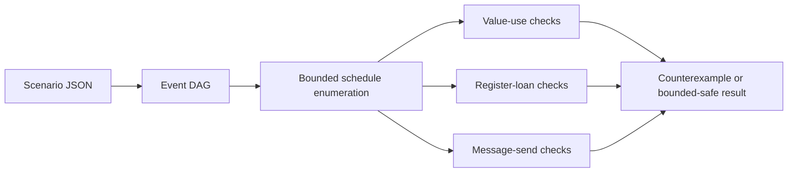

# AnvilHDL Timing-Safety Lab

[](https://github.com/ahesh-dilhan/anvilhdl-timing-safety-lab/actions/workflows/ci.yml)
[](https://github.com/ahesh-dilhan/anvilhdl-timing-safety-lab/actions/workflows/anvil-integration.yml)
[](https://www.python.org/)
[](LICENSE)

An executable companion to **“Anvil: A General-Purpose Timing-Safe Hardware
Description Language”** (ASPLOS 2026). The lab turns the paper's central ideas—
abstract events, dynamic lifetimes, register loan times, and message contracts—
into small scenarios that can be inspected, changed, and tested.

This is an independent study project by Ahesh Dilhan. It is not the AnvilHDL
compiler and is not affiliated with or endorsed by the Anvil authors. The
[official compiler](https://github.com/kisp-nus/anvil) is the source of truth.

## The 90-second demo

Only Python's standard library is required:

```bash
make doctor
make test
make demo
```

The demo enumerates bounded concrete schedules for five protocol scenarios. It
shows why a client that assumes a one-cycle response can pass one simulation
and fail at a different latency, while a contract tied to the dynamic response
event remains safe throughout the explored range.

```text
request ── dynamic latency ──> response
   │                              │
   └──── address loan time ───────┘
                                  └── mutation is safe at this boundary
```

To inspect a single scenario or get machine-readable output:

```bash
PYTHONPATH=src python3 -m anvil_lab experiments/01_safe_dynamic_cache.json
PYTHONPATH=src python3 -m anvil_lab --json experiments/02_early_address_mutation.json
```

Current host-only results (verified by `make ci`):

| Scenario | Schedules | Result | Key observation |
| --- | ---: | --- | --- |
| Dynamic cache | 3 | bounded safe | Mutation begins exactly when the response event ends the loan. |
| Early address mutation | 3 | unsafe in 2 | Latency 1 passes; latencies 2–3 overlap the loan. |
| Premature output read | 2 | unsafe in 2 | Fixed cycle-1 sampling precedes a cycle-2/3 response. |
| Overlapping send | 2 | unsafe in 1 | One dynamic start overlaps an existing promise for the same message. |
| Short-lived send source | 1 | unsafe in 1 | The source expires before its promised send interval ends. |

## What the lab checks

Each JSON experiment defines an event DAG, fixed or bounded-dynamic delays, and
half-open intervals `[start, end)`. The checker enumerates all delay assignments
within the declared bounds and applies the three obligations from Section 5 of
the paper:

| Paper obligation | Executable question |
| --- | --- |
| Valid value use | Is every use interval contained in the value's lifetime? |
| Valid register mutation | Is every mutation disjoint from the register's loan time? |
| Valid message send | Does the source live for the promised interval, without overlapping promises? |

The first failing schedule is reported as a compact counterexample with event
times and the dynamic-delay assignment that triggered it.



## Scope and intellectual honesty

The executable model is a **bounded teaching oracle** and a possible seed for
future differential testing. “Bounded safe” means safe for every schedule in
the finite latency ranges written in a scenario. Anvil's compiler instead
reasons symbolically about unbounded dynamic events and its paper proves timing
safety for well-typed programs. This lab does not claim that theorem, compiler
equivalence, functional correctness, deadlock freedom, CDC safety, or physical
timing closure.

That distinction is deliberate: a small oracle is useful for explaining type
errors, generating minimal counterexamples, and testing compiler diagnostics,
without misrepresenting bounded exploration as formal proof.

## Repository map

| Path | Purpose |
| --- | --- |
| [`src/anvil_lab`](src/anvil_lab) | Event model, safety checks, JSON loader, and CLI |
| [`experiments`](experiments) | Reproducible safe and unsafe timing scenarios |
| [`tests`](tests) | Unit and regression tests using only `unittest` |
| [`anvil`](anvil) | Small source-level exercises for the official compiler |
| [`docs/paper-notes.md`](docs/paper-notes.md) | Section-by-section technical reading notes |
| [`docs/research-discussion-guide.md`](docs/research-discussion-guide.md) | Concise explanations, research questions, and discussion prompts |
| [`docs/study-guide.md`](docs/study-guide.md) | Two-day path from the motivating hazard to compiler infrastructure |
| [`docs/experiment-design.md`](docs/experiment-design.md) | Model assumptions and falsifiable experiment hypotheses |
| [`docs/scenario-schema.md`](docs/scenario-schema.md) | JSON format for adding bounded timing litmus tests |
| [`docs/reproducibility.md`](docs/reproducibility.md) | Exact local and upstream-toolchain workflow |
| [`UPSTREAM.lock`](UPSTREAM.lock) | Pinned official Anvil repository revision |

## Why Anvil is interesting

Conventional RTL exposes registers and cycles, but its interfaces usually do
not say how long a signal must stay meaningful and unchanged. HLS avoids many
such hazards by hiding those details. Filament retains cycle-level control but
uses static timelines. Anvil's key move is to express a lifetime using abstract
events such as “from request acknowledgement until the next response,” allowing
a static type system to describe runtime-variable latency.

The compiler lowers processes to SystemVerilog modules, channels to data/valid/
ack ports as needed, and the event graph to control logic. Lifetimes and loans
are compile-time reasoning devices; no runtime safety monitor is emitted.

## Reproducible upstream integration

The independent model always runs without external packages. A separate
workflow builds the official compiler revision recorded in
[`UPSTREAM.lock`](UPSTREAM.lock). The verified suite currently matches all five
expectations: two accepted fixtures and three intentional rejections covering
value use, register mutation under loan, and overlapping message promises. See
[`docs/reproducibility.md`](docs/reproducibility.md) before updating that pin.

## References

- Jason Zhijingcheng Yu, Aditya Ranjan Jha, Umang Mathur, Trevor E. Carlson,
  and Prateek Saxena. “Anvil: A General-Purpose Timing-Safe Hardware
  Description Language.” ASPLOS 2026, Vol. 2, pp. 110–136.
  [DOI:10.1145/3779212.3790125](https://doi.org/10.1145/3779212.3790125);
  study source: [arXiv:2503.19447v2](https://arxiv.org/abs/2503.19447)
- [Official AnvilHDL repository](https://github.com/kisp-nus/anvil)
- [AnvilHDL documentation](https://docs.anvil.kisp-lab.org/)

## License

The original code and notes in this repository are MIT licensed. AnvilHDL is a
separate MIT-licensed project owned by its contributors; no upstream source is
vendored here.
